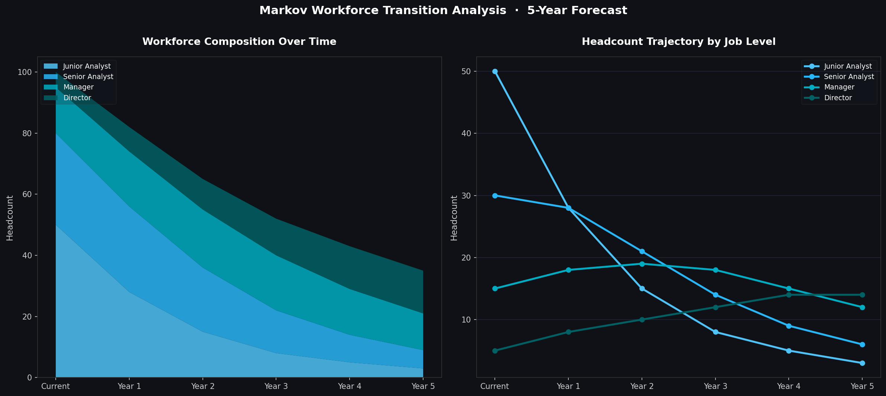
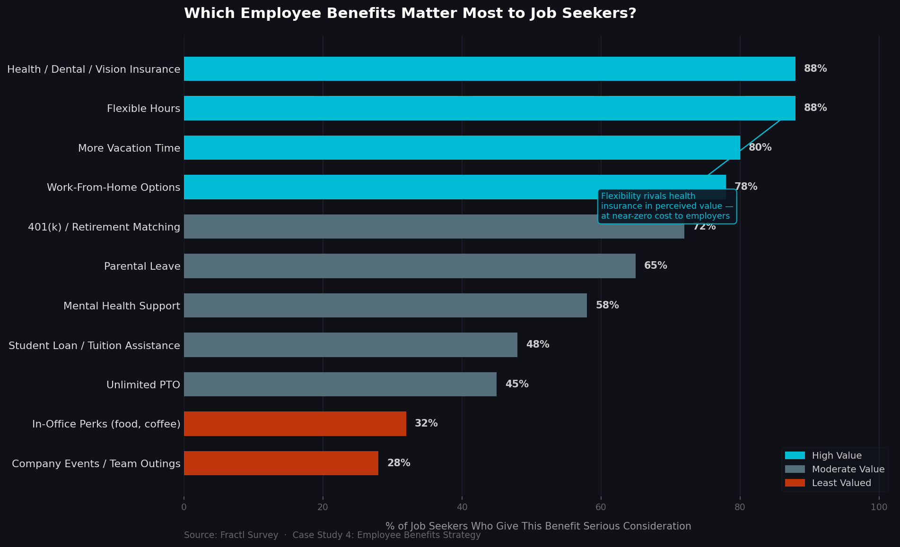

# Workforce Strategy & Organizational Effectiveness Analysis

> A business analysis portfolio examining Human Resource Management through research-backed case studies and working data models — covering workforce planning, appraisal politics, employee benefits strategy, and the transformation of HR into a strategic function.

---

## About This Repository

This portfolio demonstrates applied business analysis skills across five HR-focused case studies, supported by working Python data models and visualizations. Each analysis examines a real-world HR topic through the lens of academic research, quantitative modeling, and practical organizational implications.

**Skills demonstrated:** Critical analysis · Research synthesis · HR domain knowledge · Data modeling · Python · Strategic thinking · Written communication

---

## Case Studies

| # | Topic | Key Concepts |
|---|-------|--------------|
| 1 | [Performance Appraisal Politics](#1-performance-appraisal-politics) | Organizational politics, rater bias, appraisal integrity |
| 2 | [Markov Analysis for Workforce Planning](#2-markov-analysis-for-workforce-planning) | Forecasting models, talent flow, HR planning |
| 3 | [SHRM: The Global Standard in HR Certification](#3-shrm-the-global-standard-in-hr-certification) | Certifications, professional development, SHRM vs HRCI |
| 4 | [Employee Benefits Strategy](#4-employee-benefits-strategy) | Benefits valuation, retention, work-life balance |
| 5 | [Why We Hate HR — And How to Fix It](#5-why-we-hate-hr--and-how-to-fix-it) | HR perception, strategic HR, business partnership |

---

## Case Studies

### 1. Performance Appraisal Politics

📄 [Full Analysis →](analyses/01-performance-appraisal-politics.md)

**Core Question:** Are performance appraisals ever truly objective?

Based on *"Behind the Mask: The Politics of Employee Appraisal"*, this analysis examines how executives deliberately distort performance ratings for political reasons — and whether that's always a bad thing.

**Key Findings:**
- Executives prioritize relationship maintenance and motivation over appraisal accuracy
- Rating inflation is common and often strategic, not malicious
- The traditional academic focus on "objective" appraisals is largely unrealistic
- Accountability mechanisms and cultural values can mitigate dysfunction

**Business Implication:** Organizations should design appraisal systems that acknowledge political realities rather than pretending they don't exist.

---

### 2. Markov Analysis for Workforce Planning

📄 [Full Analysis →](analyses/02-markov-analysis-workforce-planning.md)

**Core Question:** How can organizations forecast workforce needs quantitatively?

This analysis breaks down Markov Analysis — a statistical model for predicting employee movement between job states — and compares it against complementary HR planning models.

**Key Findings:**
- Markov Analysis uses transition probability matrices to forecast future workforce composition
- Most effective when combined with trend analysis, ratio analysis, and regression modeling
- Trend analysis is the most accessible entry point for organizations new to workforce forecasting

**Business Implication:** Data-driven HR planning gives organizations a strategic edge in identifying talent gaps before they become crises.

---

### 3. SHRM: The Global Standard in HR Certification

📄 [Full Analysis →](analyses/03-shrm-certification-overview.md)

**Core Question:** What makes SHRM the leading HR professional authority — and how does it compare to HRCI?

A deep-dive into the Society for Human Resource Management: its history, certification tiers (SHRM-CP, SHRM-SCP), membership types, and competitive positioning against HRCI.

**Key Findings:**
- SHRM serves 325,000+ members across 165 countries, impacting 235M+ workers globally
- SHRM emphasizes behavioral competencies; HRCI emphasizes policy and legal knowledge
- SHRM certifications are gaining market share due to competency-based, frequently updated content
- Specialized credentials in HR analytics and data represent the future of the field

**Business Implication:** HR professionals who invest in competency-based credentials (like SHRM-CP/SCP) are better positioned for strategic roles than those focused purely on compliance knowledge.

---

### 4. Employee Benefits Strategy

📄 [Full Analysis →](analyses/04-employee-benefits-strategy.md)

**Core Question:** What benefits actually move the needle for talent acquisition and retention?

Analyzing Fractl survey data, this case study identifies which benefits matter most to job seekers — and which ones companies over-invest in for minimal ROI.

**Key Findings:**
- 80% of employees prefer additional benefits over a pay raise
- Flexibility (flexible hours, remote work, unlimited PTO) rivals health insurance in perceived value
- In-office perks (free food, team events) are the *least* valued benefit category
- Student loan and tuition assistance is an underutilized differentiator

**Business Implication:** Companies can dramatically improve talent competitiveness without large budget increases by prioritizing flexibility over flashy office perks.

---

### 5. Why We Hate HR — And How to Fix It

📄 [Full Analysis →](analyses/05-why-we-hate-hr.md)

**Core Question:** Why does HR have such a negative reputation — and what's the path forward?

Analyzing the common critiques of HR departments and the five-step transformation playbook that turns HR from a compliance function into a genuine strategic partner.

**Key Findings:**
- HR is widely perceived as bureaucratic, disconnected from business realities, and company-serving
- The fix isn't cosmetic — it requires HR to develop real business acumen
- Automating administrative work frees HR to focus on talent and culture
- The most impactful shift: repositioning HR as an integrated strategic partner, not a support function

**Business Implication:** Organizations with strategic HR functions outperform those treating HR as a compliance department. The investment in HR transformation has compounding returns.

---

## Data Artifacts

Working code and visualizations that bring the case studies to life.

| File | Description | Case Study |
|------|-------------|------------|
| [`data/markov_workforce_analysis.py`](data/markov_workforce_analysis.py) | Markov transition model: 5-year workforce forecast with gap analysis | Case Study 2 |
| [`data/benefits_valuation_chart.py`](data/benefits_valuation_chart.py) | Benefits ranking chart from Fractl survey data | Case Study 4 |
| [`data/markov_workforce_forecast.png`](data/markov_workforce_forecast.png) | Generated: stacked area + line chart of workforce trajectory | Case Study 2 |
| [`data/benefits_valuation_chart.png`](data/benefits_valuation_chart.png) | Generated: horizontal bar chart of benefit consideration rates | Case Study 4 |

### Markov Workforce Forecast

### Employee Benefits Valuation

---

## Cross-Cutting Themes

Reading across all five analyses, three themes emerge consistently:

**1. The Gap Between Theory and Practice**
Whether it's "objective" performance appraisals or ideal workforce planning models, organizational reality consistently diverges from textbook prescriptions. Effective business analysts and HR leaders acknowledge this gap rather than pretending it doesn't exist.

**2. Data-Driven Decision Making in HR**
From Markov Analysis to benefits survey data, there is growing pressure on HR to justify decisions quantitatively. The analysts and leaders who can bridge domain expertise with data literacy will define the next generation of HR.

**3. Strategic vs. Administrative HR**
The thread running through every case study is the same tension: HR as rule-enforcer vs. HR as strategic partner. Organizations that resolve this tension in favor of strategy see compounding benefits across hiring, retention, performance, and culture.

---

## Technical Notes

All analyses are based on academic and industry research. This repository is maintained as a demonstration of business analysis methodology, research synthesis, and professional communication.

---
